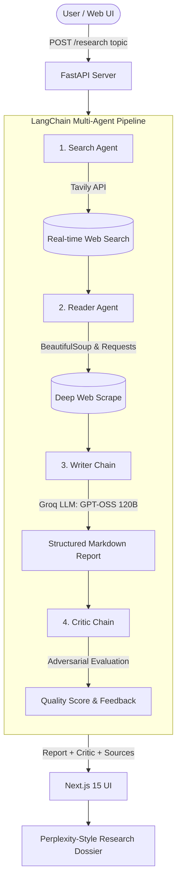

# DeepResearch AI - Full-Stack Multi-Agent Research Platform

DeepResearch AI is a production-grade autonomous research platform. It leverages a four-stage multi-agent pipeline orchestrating real-time web discovery, deep page scraping, structured technical synthesis, and automated adversarial review.

Built with a **FastAPI** backend and a **Next.js 15** (TypeScript, Tailwind CSS, Perplexity-style Dark UI) frontend.

---

## 🏛️ System Architecture



### 4-Agent Pipeline Workflow:
1. **Search Agent**: Connects to the live web via Tavily to query current and authoritative articles, generating structured titles, snippets, and source URLs.
2. **Reader Agent**: Takes the top search results and performs deep web scraping using BeautifulSoup, extracting clean full-text paragraphs.
3. **Writer Chain**: Synthesizes search snippets and deep scraped content into an organized research report containing an *Introduction*, *Key Findings*, *Conclusion*, and *Sources*.
4. **Critic Chain**: Evaluates the drafted report against strict quality standards, producing a numerical score (`Score: X/10`), key strengths, areas to improve, and a concise verdict.

---

## 💻 Tech Stack

### Backend
- **Framework**: FastAPI, Pydantic v2, Pydantic-Settings
- **Agent Orchestration**: LangChain, LangChain-Core, LangChain-Groq
- **LLM Engine**: Groq (`openai/gpt-oss-120b` or `llama-3.1-8b-instant`)
- **Tools**: Tavily Search API, BeautifulSoup4, Requests
- **Server**: Uvicorn (ASGI)

### Frontend
- **Framework**: Next.js 15 (App Router, Server & Client Components)
- **Language**: TypeScript
- **Styling**: Tailwind CSS, PostCSS, Custom Design System
- **Icons**: Lucide React
- **Markdown**: React-Markdown, Remark-GFM

### Deployment
- **Backend**: Render (Python Web Service via `render.yaml`)
- **Frontend**: Vercel

---

## 📂 Project Structure

```
LangGraphC/
├── backend/
│   ├── app/
│   │   ├── main.py                     # FastAPI app, CORS & lifecycle
│   │   ├── core/
│   │   │   └── config.py               # Pydantic Settings & Env loader
│   │   ├── schemas/
│   │   │   ├── research.py             # ResearchRequest, ResearchResponse, ResearchMetadata
│   │   │   └── health.py               # HealthResponse
│   │   ├── tools/
│   │   │   ├── search.py               # Tavily search integration
│   │   │   └── scraper.py              # BeautifulSoup web scraper
│   │   ├── agents/
│   │   │   ├── llm.py                  # Groq client factory
│   │   │   ├── search_agent.py         # Search agent builder
│   │   │   ├── reader_agent.py         # Reader scraper agent builder
│   │   │   ├── writer_chain.py         # Report generation chain
│   │   │   └── critic_chain.py         # Evaluation & critique chain
│   │   ├── services/
│   │   │   └── research_service.py     # 4-stage pipeline orchestrator & metadata extractor
│   │   └── routers/
│   │       ├── health.py               # GET /health
│   │       └── research.py             # POST /research
│   ├── requirements.txt
│   ├── .env.example
│   └── render.yaml                     # Render Blueprints specification
│
├── frontend/
│   ├── src/
│   │   ├── app/
│   │   │   ├── layout.tsx              # Root dark-mode layout & typography
│   │   │   ├── page.tsx                # Interactive Research Dashboard
│   │   │   └── globals.css             # Obsidian theme tokens & markdown styling
│   │   ├── components/
│   │   │   ├── header.tsx              # Brand bar with live API status ping
│   │   │   ├── hero-section.tsx        # Hero banner with sample prompts
│   │   │   ├── research-input.tsx      # Perplexity-style omnibar input
│   │   │   ├── activity-timeline.tsx   # Live 4-agent stepper indicator
│   │   │   ├── report-display.tsx      # Markdown report with copy & download
│   │   │   ├── critic-card.tsx         # Score badge, strengths, areas to improve
│   │   │   └── sources-list.tsx        # Citations & source links drawer
│   │   ├── lib/
│   │   │   ├── api.ts                  # Backend API client
│   │   │   └── utils.ts                # Class merging & date formatting
│   │   └── types/
│   │       └── research.ts             # TypeScript interfaces
│   ├── package.json
│   ├── tsconfig.json
│   ├── tailwind.config.ts
│   └── .env.example
│
└── README.md
```

---

## 🚀 Local Development Setup

### Prerequisites
- Python 3.10+ (or virtual environment `.venv`)
- Node.js 18+ & npm
- [Groq API Key](https://console.groq.com/)
- [Tavily API Key](https://tavily.com/)

---

### 1. Backend Setup

1. Open a terminal and navigate to the backend directory:
   ```bash
   cd backend
   ```

2. Create and activate a virtual environment (or use existing `.venv`):
   ```bash
   python3 -m venv .venv
   source .venv/bin/activate
   ```

3. Install dependencies:
   ```bash
   pip install -r requirements.txt
   ```

4. Configure environment variables:
   ```bash
   cp .env.example .env
   ```
   Edit `.env` and add your API keys:
   ```env
   GROQ_API_KEY=gsk_your_groq_api_key_here
   TAVILY_API_KEY=tvly-your_tavily_api_key_here
   GROQ_MODEL=openai/gpt-oss-120b
   ```

5. Start the FastAPI development server:
   ```bash
   uvicorn app.main:app --host 0.0.0.0 --port 8000 --reload
   ```
   - API Docs: `http://localhost:8000/docs`
   - Health Check: `http://localhost:8000/health`

---

### 2. Frontend Setup

1. Open another terminal and navigate to the frontend directory:
   ```bash
   cd frontend
   ```

2. Install dependencies:
   ```bash
   npm install
   ```

3. Configure environment variables:
   ```bash
   cp .env.example .env.local
   ```
   Ensure `NEXT_PUBLIC_API_BASE_URL` points to your backend:
   ```env
   NEXT_PUBLIC_API_BASE_URL=http://127.0.0.1:8000
   ```

4. Run the Next.js development server:
   ```bash
   npm run dev
   ```
   Open `http://localhost:3000` in your browser.

---

## 📡 API Reference

### 1. Run Research Pipeline
- **Endpoint**: `POST /research`
- **Request Body**:
  ```json
  {
    "topic": "Latest breakthroughs in quantum computing 2026"
  }
  ```
- **Response (200 OK)**:
  ```json
  {
    "report": "# Quantum Computing 2026\n\n### Introduction\n...",
    "critic": "Score: 9/10\n\nStrengths:\n- Detailed technical breakdown\n\nAreas to Improve:\n- Include more commercial timelines\n\nOne line verdict:\nExceptional synthesis.",
    "metadata": {
      "sources": [
        "https://example.com/quantum-news",
        "https://nature.com/articles/quantum-2026"
      ],
      "timestamp": "2026-08-22T08:00:00.000Z"
    }
  }
  ```

### 2. Health Check
- **Endpoint**: `GET /health`
- **Response (200 OK)**:
  ```json
  {
    "status": "healthy",
    "version": "1.0.0"
  }
  ```

---

<! -- ## 🚢 Deployment Guide

### Deploy Backend on Render

1. Create a free account at [Render.com](https://render.com/).
2. Push your repository to GitHub.
3. In Render Dashboard, click **New +** $\to$ **Blueprint** (or **Web Service**).
4. Connect your GitHub repository. Render will automatically detect `backend/render.yaml` or you can manually configure:
   - **Root Directory**: `backend`
   - **Build Command**: `pip install -r requirements.txt`
   - **Start Command**: `uvicorn app.main:app --host 0.0.0.0 --port $PORT`
   - **Health Check Path**: `/health`
5. Add the following **Environment Variables** in the Render dashboard:
   - `GROQ_API_KEY`: Your Groq API key
   - `TAVILY_API_KEY`: Your Tavily API key
   - `GROQ_MODEL`: `openai/gpt-oss-120b` (or `llama-3.1-8b-instant`)
6. Deploy! Render will provide your public backend URL (e.g., `https://langchain-research-backend.onrender.com`).

---

### Deploy Frontend on Vercel

1. Create an account at [Vercel.com](https://vercel.com/).
2. Click **Add New...** $\to$ **Project** and import your GitHub repository.
3. Configure the project settings:
   - **Framework Preset**: Next.js
   - **Root Directory**: `frontend`
4. Add the **Environment Variable**:
   - `NEXT_PUBLIC_API_BASE_URL`: `https://your-render-backend-url.onrender.com`
5. Click **Deploy**. Vercel will build and serve the application with worldwide CDN distribution. -->

---

## 🔮 Future Improvements

- **Streaming / Server-Sent Events (SSE)**: Stream token-by-token research reports and live agent status ticks.
- **Multi-Turn Chat**: Ask follow-up questions on any generated research report.
- **PDF Export**: Generate downloadable, styled PDF whitepapers.
- **Graph Visualization**: Visual knowledge graph showing citation clusters and entity relationships.
